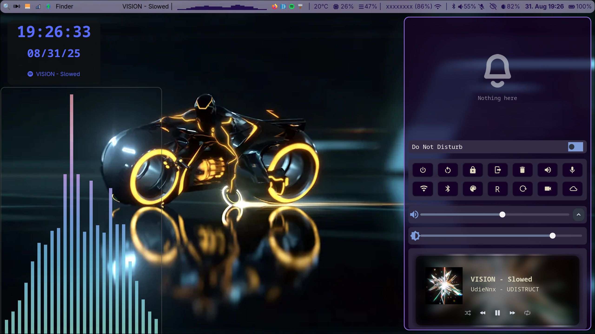

#  My dotfiles 🐧

My personal collection of configuration files for my Arch Linux setup running the Hyprland compositer.

## Why This Exists

I made this repository for two main reasons:
* To learn more about Git and GitHub.
* To make it easy for my dad (and you!) to download and try out my configs!

## My Setup
* **OS**: Arch Linux
* **WM**: [Hyprland](https://github.com/hyprwm/Hyprland)
* **Bar**: [Waybar](https://github.com/Alexays/Waybar)
* **Widgets**: [Eww](https://github.com/elkowar/eww)
* **Notifications**: [SwayNC](https://github.com/ErikReider/SwayNotificationCenter)
* **Terminal**: [Kitty](https://github.com/kovidgoyal/kitty)
* **Shell**: Bash with [Starship](https://github.com/starship/starship)
* **Hardware**: Lenovo Thinkpad T480

## Desktop

*wallpaper changed for privacy reasons*

## Things to do if you download this
* Create a screen shots folder in your home directory
* Most wallpaper/backgrounds point to "/wallpaper/firstcar.jpg", please change this to your own img :)

---
*This is a work in progress!*
---

*Useful things I've found*
if you want to have something on your desktop, say cava, and want it pinned to all desktops and
always in the background (unlike floating tabs), use Kitty + [kittens](https://sw.kovidgoyal.net/kitty/kittens/panel/).

The cool quick panel stuff is all SwayNC, it took me WAY too long to find that out lol

