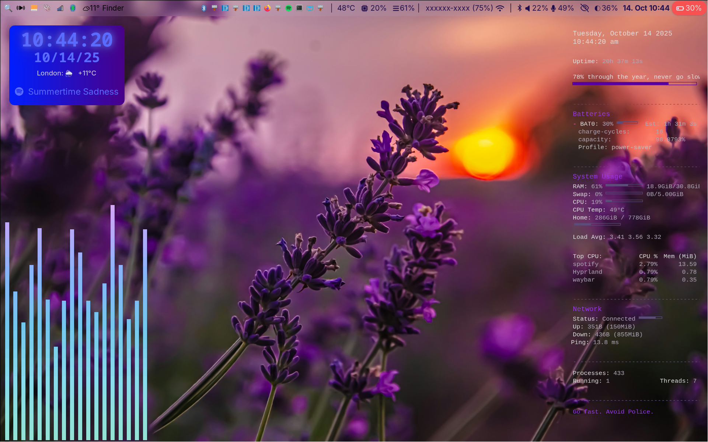
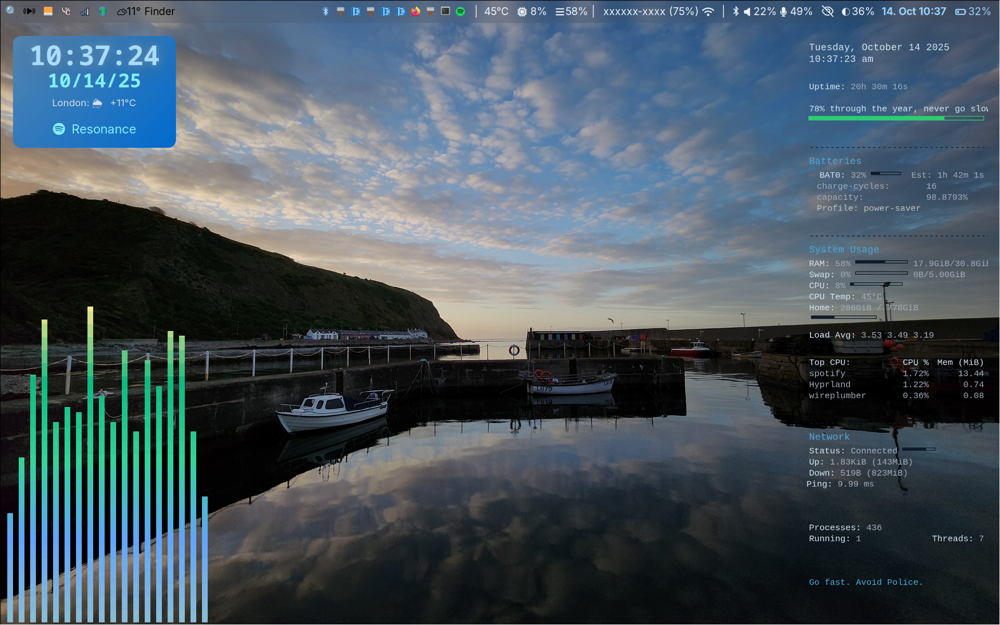
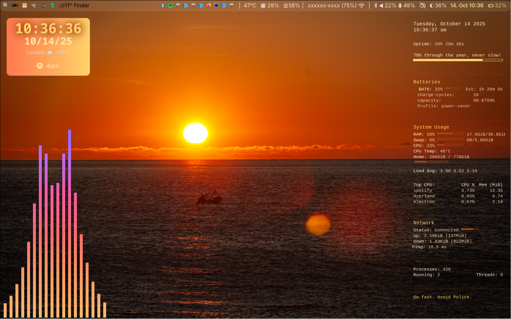

My personal collection of configuration files for my Arch Linux setup running the Hyprland compositer.

I have recently upgraded to a T14S, so if you have an older thinkpad (T480 etc), check out my T480 branch! :)

## Why This Exists

I made this repository for two main reasons:
* To learn more about Git and GitHub.
* To make it easy for my dad (and you!) to download and try out my configs!

## My Setup
* **OS**: Arch Linux
* **WM**: [Hyprland](https://github.com/hyprwm/Hyprland)
* **Bar**: [Waybar](https://github.com/Alexays/Waybar)
* **Widgets**: [Eww](https://github.com/elkowar/eww)
* **Notifications**: [SwayNC](https://github.com/ErikReider/SwayNotificationCenter)
* **Terminal**: [Kitty](https://github.com/kovidgoyal/kitty)
* **Shell**: Bash with [Starship](https://github.com/starship/starship)
* **Hardware**: Lenovo Thinkpad T14S

## Desktop + themes
I have finally got around to adding themes!! :D, enjoy!
| Purple 💜 | Holiday 🌊 | Sunset 🌅 |
|:--:|:--:|:--:|
|  |  |  |

bigger images below. 

  
💜 Purple Theme

  

  
🌊 Holiday Theme

  

  
🌅 Sunset Theme

  

*wallpaper changed for privacy reasons also I don't live in London lol*

## Things to do if you download this
* Clone this github repo
* Run install.sh as a USER, not as root.
---

*Useful things I've found*

- if you want to have something on your desktop, say cava, and want it pinned to all desktops and
  always in the background (unlike floating tabs), use Kitty + [kittens](https://sw.kovidgoyal.net/kitty/kittens/panel/).

- The cool quick panel stuff is all SwayNC, it took me WAY too long to find that out lol
*This is a work in progress!*
---

